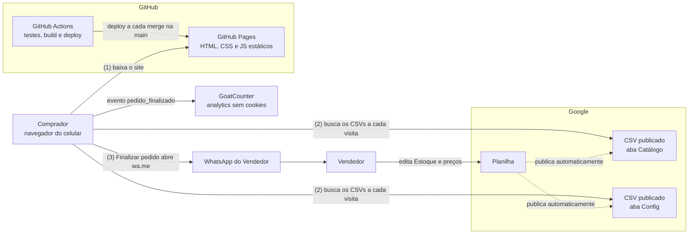
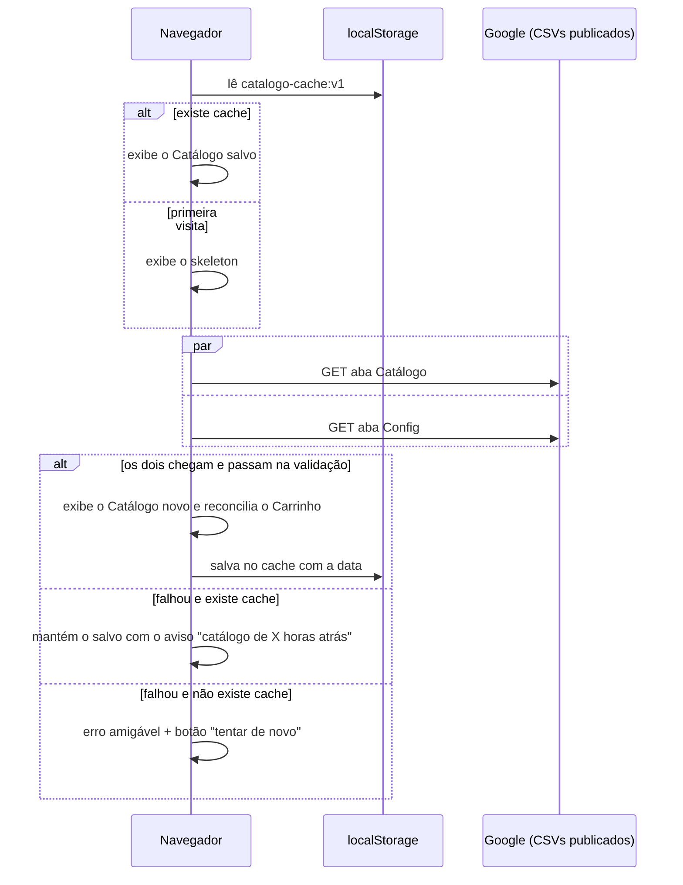
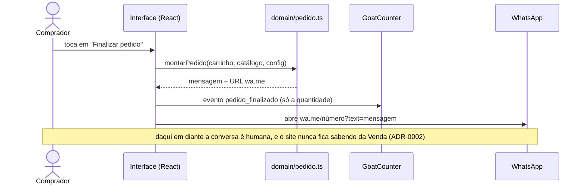
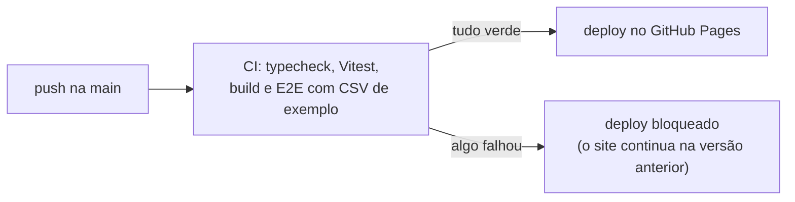

# System Design: Catálogo de Figurinhas

> **Status:** proposta · **Última revisão:** 2026-09-27
> **Leia antes:** [CONTEXT.md](../CONTEXT.md) (vocabulário) e [docs/adr/](./adr/) (decisões). Este documento mostra como as decisões se encaixam. O porquê de cada uma está nos ADRs.

## 1. Contexto

Um Vendedor quer divulgar pelo WhatsApp as suas figurinhas avulsas do álbum da Copa 2026, sem mandar a lista inteira toda vez. O Comprador abre um link, encontra o que falta no álbum dele, monta um Carrinho e envia o Pedido pelo WhatsApp. A Venda acontece na conversa, fora do sistema.

O projeto tem três restrições que moldam tudo o que vem abaixo:

- **Custo de operação zero.**
- **O Vendedor opera sozinho**, editando uma planilha.
- **Nenhum backend nem banco de dados** ([ADR-0001](./adr/0001-planilha-google-como-fonte-da-verdade.md)).

## 2. Requisitos

### Funcionais

| # | O sistema deve... |
|---|---|
| RF1 | Exibir o Catálogo (Figurinhas com Estoque > 0) agrupado por Seção, na ordem do Álbum. |
| RF2 | Buscar por Código de forma tolerante (`bra10`, `BRA 10`, `bra-10`), por nome sem acento e por Seção. |
| RF3 | Interpretar uma Lista de Faltantes colada, mostrar o que foi e o que não foi encontrado e adicionar ao Carrinho todas as Figurinhas disponíveis. |
| RF4 | Filtrar por Tipo (chips) e navegar por um índice de Seções. O filtro de Álbum só aparece se houver mais de um. |
| RF5 | Manter um Carrinho com quantidade limitada ao Estoque, que sobrevive ao fechar a aba e é reconciliado com o Catálogo atual. |
| RF6 | Mostrar o total estimado, calculado pelo Preço de cada Tipo. |
| RF7 | Finalizar o Pedido abrindo o WhatsApp com uma mensagem compacta agrupada por Seção, com a alternativa de copiar a mensagem. |
| RF8 | Abrir direto numa Seção pelo link (`…/#BRA`). |
| RF9 | Começar no tema claro, com botão para o escuro e a escolha salva. |
| RF10 | Gerar uma prévia de link (Open Graph) quando for compartilhado no WhatsApp. |
| RF11 | Registrar um evento anônimo `pedido_finalizado`. |
| RF12 | Publicar a página `/styleguide` para o Vendedor aprovar o visual. |

### Não funcionais

| Atributo | Meta |
|---|---|
| Custo | R$ 0/mês (GitHub Pages, Google Sheets, GoatCounter). |
| Operação | O Vendedor muda Estoque, preços e número do WhatsApp sem precisar de dev. |
| Atualização | Uma edição na planilha aparece para todo mundo em até ~5 minutos (medido no spike S1). |
| Disponibilidade | Se o Google falhar, o site continua útil com o último Catálogo válido ([ADR-0003](./adr/0003-planilha-lida-no-navegador-via-csv-publicado.md)). |
| Performance | No celular com 4G: JavaScript ≤ 100 KB (gzip) e conteúdo principal visível (LCP) em menos de 2,5 s. |
| Acessibilidade | WCAG 2.1 AA ([design system](./design-system.md#critérios-de-pronto-acessibilidade)). |
| Privacidade | Nenhum dado pessoal coletado. Analytics sem cookies, sem banner de LGPD. |

### Estimativa de carga

O pior caso realista é o Vendedor postar o link num grupo grande: cerca de 50 pessoas abrindo em 10 minutos. Cada visita faz 1 download do site (cacheado pela CDN do GitHub) e 2 requisições de CSV ao Google. Isso dá **cerca de 100 requisições em 10 minutos, nada que preocupe**. O tamanho do Catálogo é limitado pelo Álbum: 980 Figurinhas, uns 40 KB de CSV.

### Fora do escopo

Pagamento, reserva de Estoque, registro de Pedidos ([ADR-0002](./adr/0002-pedido-nao-reserva-estoque.md)), contas de usuário, painel administrativo, cards (Adrenalyn/Match Attax) e Instagram.

## 3. Arquitetura



| Componente | Responsabilidade | Quem mantém |
|---|---|---|
| GitHub Pages | Servir os arquivos estáticos do site via CDN. | Automático (deploy pelo Actions) |
| Planilha Google | Fonte da verdade do Catálogo e da Config. | Vendedor |
| CSV publicado | Expor **só** as abas Catálogo e Config para leitura pública. | Google |
| Navegador do Comprador | Buscar, validar, exibir, manter o Carrinho e montar o Pedido. **Faz o papel que um backend faria.** | Nosso código |
| WhatsApp (`wa.me`) | Levar o Pedido até o Vendedor. | Meta |
| GoatCounter | Contar visitas e Pedidos finalizados, sem cookies. | Serviço externo |

## 4. Modelo de dados

### 4.1 A planilha: o contrato com o Vendedor

**Aba `Catálogo`:** uma linha por Figurinha do checklist oficial, na ordem do Álbum.

| Álbum | Código | Nome | Tipo | **Estoque** | Imagem |
|---|---|---|---|---|---|
| Copa 2026 | BRA 10 | Vinícius Jr. | Comum | **3** | |
| Copa 2026 | BRA 1 | Escudo | Especial | **1** | |

- O Vendedor edita **só a coluna Estoque** (e Imagem, se quiser). As outras vêm do checklist e ficam **protegidas** contra edição.
- **A Seção não é uma coluna:** ela é derivada do Código ("BRA 10" → BRA). O nome da Seção ("Brasil"), a ordem e as cores ficam num arquivo de dados no código (§6). Guardar o mesmo fato em dois lugares foi o que gerou dados inconsistentes no site de referência.

**Aba `Config`:** pares chave e valor, legíveis para o Vendedor. A coluna A é sempre a chave e a B o valor. **Não há cabeçalho obrigatório**, e linhas vazias ou com chave desconhecida são ignoradas: o spike mostrou que uma célula perdida vira linha no CSV.

| Chave | Valor |
|---|---|
| WhatsApp | 5511999999999 |
| Nome da loja | Figurinhas do Fulano |
| Preço Comum | 1,50 |
| Preço Especial | 5,00 |

Cada linha `Preço <Tipo>` define o Preço de um Tipo. Criar um Tipo novo é só adicionar uma linha. A especificação completa, com validações de célula e intervalos protegidos, vai para o `docs/modelo-da-planilha.md`.

### 4.2 Tipos do domínio

Rascunho do que vai morar em `src/domain/`. Os nomes seguem o [CONTEXT.md](../CONTEXT.md).

```ts
type Tipo = string; // "Comum", "Especial"... quem define é a aba Config

interface Figurinha {
  album: string;    // "Copa 2026"
  codigo: string;   // "BRA 10" (forma canônica: sigla, espaço, número)
  secao: string;    // "BRA" (derivada do código)
  numero: number;   // 10
  nome: string;
  tipo: Tipo;
  estoque: number;  // inteiro > 0 (Estoque 0 não entra no Catálogo)
  imagem?: string;  // só URL https
}

interface Config {
  whatsapp: string;               // só dígitos, com DDI
  nomeLoja: string;
  precos: Record<Tipo, number>;   // { Comum: 1.5, Especial: 5 }
}

interface ItemDoCarrinho {
  album: string;
  codigo: string;
  quantidade: number; // de 1 até o Estoque
}
```

A identidade de uma Figurinha é o par **Álbum + Código**. O Carrinho guarda **só essa referência e a quantidade**, nunca uma cópia do nome, do Preço ou do Estoque. Esses dados sempre vêm do Catálogo atual, e é isso que torna a reconciliação possível (§5.1).

### 4.3 O que fica no navegador (localStorage)

| Chave | Conteúdo |
|---|---|
| `carrinho:v1` | `{ itens: ItemDoCarrinho[] }` |
| `catalogo-cache:v1` | `{ salvoEm, figurinhas, config }`: o último Catálogo válido |
| `tema` | `"claro"` ou `"escuro"` |

O sufixo `:v1` versiona o formato: se ele mudar, o código ignora dados `v1` antigos em vez de quebrar. Todo acesso ao localStorage fica protegido, porque ele pode não existir (aba anônima, cookies bloqueados), e nesse caso o site funciona só com memória.

## 5. Fluxos principais

### 5.1 Carregar a página (stale-while-revalidate)



**Reconciliar o Carrinho:** para cada item salvo, a quantidade é reduzida até o Estoque atual e os itens que zeraram ou sumiram do Catálogo saem, com um aviso ("2 figurinhas do seu carrinho não estão mais disponíveis").

### 5.2 Colar a Lista de Faltantes

1. O Comprador cola `BRA 3, 7, 12; ARG 1; FWC 4` na busca.
2. `domain/faltantes.ts` interpreta o texto e gera uma lista de Códigos canônicos. Quando o número aparece sem sigla, ele herda a última sigla citada ("7" depois de "BRA 3" vira "BRA 7").
3. A interface cruza essa lista com o Catálogo e mostra *"você procurou 6, temos 4"*, com as encontradas, as indisponíveis e o botão **"Adicionar todas ao carrinho"**.

### 5.3 Finalizar o Pedido



Formato da mensagem (compacto, do jeito que o colecionador escreve, e que mantém a URL curta):

```
Olá! Tenho interesse nestas figurinhas (Copa 2026):

BRA: 3, 7, 12 (2x)
ARG: 1, 15
FWC: 4

Total: 7 figurinhas · R$ 14,50 estimado
Sujeito a confirmação de disponibilidade.
```

**Depois de finalizar**, o Carrinho **não** é esvaziado automaticamente: se o Comprador não chegar a enviar a mensagem, nada se perde. O painel do Carrinho passa a mostrar duas ações:

- **"Pedido enviado? Limpar carrinho"**;
- **"Não abriu? Copie a mensagem"**, com o número do Vendedor, para quando o WhatsApp não abrir (§8).

### 5.4 O Vendedor dá Baixa

O Vendedor fecha uma Venda no WhatsApp, abre a planilha no celular e diminui o Estoque. O Google republica o CSV automaticamente, e em alguns minutos (spike S1) o site mostra o novo Estoque. Figurinha com Estoque 0 some do Catálogo.

## 6. Arquitetura do front-end

### 6.1 Camadas

```
src/
├── domain/          ← TypeScript puro: regras de negócio, sem React e sem rede (ADR-0004)
│   ├── catalogo.ts      ler e validar as linhas da aba Catálogo
│   ├── config.ts        ler e validar a aba Config
│   ├── busca.ts         normalizar texto e buscar
│   ├── faltantes.ts     interpretar a Lista de Faltantes
│   ├── carrinho.ts      adicionar, remover, reconciliar
│   └── pedido.ts        total por Tipo, mensagem e URL wa.me
├── infra/           ← a fronteira com o mundo externo
│   ├── planilha.ts      baixar os CSVs
│   ├── armazenamento.ts localStorage com proteção contra falha
│   └── analytics.ts     GoatCounter
├── data/
│   └── secoes.ts        sigla → nome, ordem e cores da bandeira (fato fixo)
├── ui/              ← React: componentes do design system e telas
└── styles/
    └── tokens.css       tokens primitivos e semânticos
```

**Regra de dependência:** `ui` pode usar `domain` e `infra`, e `infra` pode usar `domain`, mas **`domain` não importa nada** do projeto. É o padrão *núcleo funcional, casca imperativa* (*functional core, imperative shell*): tudo o que é decisão vive no núcleo e é testável sem navegador; tudo o que toca o mundo (rede, disco, tela) fica na casca, fina e sem regra.

### 6.2 Escolhas que não viraram ADR

| Escolha | Por quê | Revisitar se... |
|---|---|---|
| **Papa Parse** para ler o CSV (~7 KB) | CSV parece simples, mas tem armadilhas: vírgula dentro de aspas, quebra de linha dentro de célula, e o "1,50" brasileiro. Um parser próprio seria bug garantido. | nunca |
| **Sem biblioteca de estado** (só `useState`/`useReducer` do React) | São três estados pequenos: o carregamento do Catálogo, o Carrinho e os filtros. | o estado começar a ser compartilhado entre muitas telas |
| **Sem virtualização da lista** | No máximo algumas centenas de linhas com Estoque. O CSS `content-visibility: auto` nas Seções resolve o custo de renderização. | o Catálogo passar de ~2.000 itens |
| **Multi-página no Vite** (`index.html` + `styleguide.html`) em vez de um roteador | O GitHub Pages não sabe redirecionar rotas de SPA: `/styleguide` daria 404. Dois HTMLs é a solução mais simples. | surgirem muitas páginas |
| **Estado de carregamento como união discriminada** (`carregando`, `pronto`, `defasado`, `erro`) | Torna impossível representar estados absurdos, como "carregando" e "erro" ao mesmo tempo. | nunca |

## 7. Validação: tolerância a dados ruins

Quem digita os dados é uma pessoa, no celular. O site **nunca** quebra por causa de uma célula. A leitura de cada aba devolve `{ dados, problemas[] }`: as linhas boas seguem, e cada problema é registrado no console com linha e motivo.

| Situação | Reação |
|---|---|
| Estoque `"3"` ou `" 3 "` | aceito (3) |
| Estoque `"dois"`, `"3,5"`, `"-1"` | linha ignorada + problema registrado |
| Estoque vazio ou `0` | fora do Catálogo (não é erro) |
| Código fora do padrão `SIGLA NÚMERO` | linha ignorada + problema registrado |
| Código duplicado | vale a primeira ocorrência + problema registrado |
| Tipo sem `Preço <Tipo>` na Config | Figurinhas desse Tipo ocultas + problema registrado |
| Preço `"1,5"`, `"1,50"`, `"1.50"` ou `"R$ 1,50"` | aceito (1,5). O CSV publicado exporta o valor **como ele aparece formatado** na planilha em português, com vírgula e entre aspas (spike S3) |
| Linha vazia (`,`) ou com lixo numa célula solta | ignorada, sem registrar problema |
| Imagem que não começa com `https://` | imagem ignorada, Figurinha exibida sem ela |
| **Coluna obrigatória ausente ou renomeada** | a aba inteira é inválida e o site trata como falha de carregamento (usa o cache, §5.1) |

## 8. Modos de falha

| Falha | Efeito para o Comprador | Como o sistema reage |
|---|---|---|
| Google fora do ar ou lento | vê um Catálogo possivelmente defasado | último Catálogo válido + aviso com a idade dos dados |
| Logo depois de uma Baixa, o CSV alterna entre a versão nova e a antiga (consistência eventual, spike S1) | por até ~5 minutos, pode ver uma Figurinha que acabou de ser vendida | risco aceito ([ADR-0002](./adr/0002-pedido-nao-reserva-estoque.md)): tudo é "sujeito a confirmação" |
| O Google deixa de liberar CORS no CSV publicado | o site não carrega os dados | hoje funciona (spike S1). Se mudar, o plano B é gerar o JSON no build, alternativa já avaliada no ADR-0003 |
| Coluna apagada ou renomeada na planilha | igual a "Google fora do ar" | aba inválida → cache (§7) |
| localStorage indisponível | o Carrinho some ao fechar a aba | tudo funciona em memória, sem aviso |
| Estoque mudou com um Carrinho salvo | itens reduzidos ou removidos | reconciliação + aviso (§5.1) |
| Duas pessoas pedem a última unidade | uma delas ouve "acabou" no WhatsApp | risco aceito ([ADR-0002](./adr/0002-pedido-nao-reserva-estoque.md)) |
| Mensagem longa demais para o `wa.me` | o WhatsApp corta ou não abre | improvável: com o formato compacto, um Pedido de 200 figurinhas tem ~1.100 caracteres e abriu inteiro no celular e no computador (spike S2) |
| Comprador está no computador, sem o app do WhatsApp | o `wa.me` abre uma página intermediária; sem o app, ele cai no WhatsApp Web e precisa escanear um QR code com o celular. Pode desistir no meio | o site não consegue saber se o WhatsApp abriu. Depois de "Finalizar pedido", o painel oferece **"Não abriu? Copie a mensagem"** com o número do Vendedor, e o Pedido segue por qualquer caminho |
| O Vendedor apaga sem querer a linha de uma Figurinha | a Figurinha some do site, como se o Estoque fosse 0. Quem já a tinha no Carrinho recebe o aviso "não está mais disponível" na próxima visita | **prevenção:** as colunas protegidas impedem um editor de apagar a linha (confirmar na planilha de teste do spike S1). Se acontecer mesmo assim, o histórico de versões da planilha recupera a linha. O site não tem como perceber, porque não distingue "apagada" de "vendida" |

## 9. Segurança e privacidade

- **O que é público é só o que foi publicado:** as abas Catálogo e Config. A planilha em si é compartilhada só com o Vendedor e o dev como editores, **nunca** com "qualquer pessoa com o link pode editar".
- **Nenhum segredo no front-end.** O número do WhatsApp é público por natureza, porque está na mensagem.
- **Dados da planilha são exibidos sempre como texto.** O React já escapa o conteúdo, e o projeto não usa `dangerouslySetInnerHTML`. A coluna Imagem só aceita `https://`, o que bloqueia URLs `javascript:`.
- **Nenhum dado pessoal:** o Comprador não se identifica no site. O GoatCounter conta sem cookies, e o evento carrega só a quantidade de figurinhas.

## 10. Build, CI e deploy



- **Sem PRs:** o projeto é solo, então os commits vão direto na `main`. A proteção fica no CI: o deploy só acontece se todas as verificações passarem, e um commit quebrado nunca chega ao site.
- **Dois ambientes:** local (`npm run dev`) e produção (Pages). Não há homologação.
- **URLs dos CSVs em variáveis de ambiente** (`VITE_CSV_CATALOGO_URL`, `VITE_CSV_CONFIG_URL`). O E2E aponta para arquivos de exemplo do repositório, e o CI nunca depende do Google.
- **Pegadinha do GitHub Pages:** o site fica em `/catalogo-figurinhas/`, não na raiz. O Vite precisa de `base: '/catalogo-figurinhas/'`, senão todo CSS e JS dá 404 em produção, mesmo funcionando no local.

## 11. Observabilidade

- **GoatCounter:** visitas e o evento `pedido_finalizado`. Esse é o número que prova o valor do site para o Vendedor.
- **Console do navegador:** os problemas de dados da §7, para diagnóstico quando o Vendedor disser "a figurinha X não aparece".
- **Sem serviço de rastreamento de erros** (Sentry etc.). É desproporcional para o tamanho do projeto.

## 12. Estratégia de testes

| Nível | Ferramenta | O que cobre |
|---|---|---|
| Unitário, com TDD | Vitest | Tudo em `src/domain/`: validação das abas, busca, Lista de Faltantes, reconciliação do Carrinho, total e mensagem. |
| Ponta a ponta (1 cenário) | Playwright | Carregar com CSV de exemplo → buscar → adicionar → finalizar → conferir a URL `wa.me` gerada. |
| Acessibilidade | revisão AA | Antes de enviar o `/styleguide` ao Vendedor. |

Nada de teste de aparência ("o botão é amarelo"). O design é verificado olhando, no `/styleguide`.

## 13. Riscos e spikes pendentes

| # | Pergunta | Por que importa | Como responder |
|---|---|---|---|
| S1 | O CSV publicado aceita `fetch` de outro domínio (CORS)? Quanto tempo leva para uma edição aparecer? | Sustenta o [ADR-0003](./adr/0003-planilha-lida-no-navegador-via-csv-publicado.md). Se falhar, a arquitetura de leitura muda. | ✅ **Respondido em 2026-09-27:** CORS liberado; a edição se propaga em até ~5 min, com oscilação entre versões. Detalhes no ADR-0003 |
| S2 | Qual o tamanho máximo prático de uma mensagem no `wa.me` (Android, iOS, desktop)? | Carrinhos grandes podem ser cortados. | ✅ **Respondido:** 200 figurinhas geram ~1.100 caracteres (URL de ~2.100) e a mensagem abriu inteira no celular e no computador |
| S3 | Como o Google exporta números no CSV de uma planilha em português ("1,50" ou "1.50")? | Define o parser de Preço. | ✅ **Respondido:** vem como aparece formatado, com vírgula e entre aspas (`"1,5"`) |
| R1 | O Google limita o CSV publicado com tráfego alto? | Um link viralizando poderia falhar. | Sem dados. O cache local mitiga, e o plano B é o JSON no build |

## 14. Questões em aberto

- **Endereço definitivo do site** (pergunta 7 ao Vendedor). O `eduardofedeli.github.io` tem o nome do dev, não o da loja, e pode gerar desconfiança nos Compradores. Opções:
  - **(a)** manter o GitHub Pages;
  - **(b)** subdomínio gratuito com o nome da loja (ex.: Vercel);
  - **(c)** domínio próprio, que funciona tanto no GitHub Pages quanto na Vercel.

  Com (b) ou (c), o site passa a morar na raiz do domínio, e o `base` do Vite deixa de ser `/catalogo-figurinhas/`. Com (b), o deploy passa a ser feito pela integração Git da Vercel, e não pelo `publicar.yml`. **Trocar o endereço depois de divulgado quebra os links já compartilhados**, então a decisão precisa vir antes do lançamento, não antes do beta.

O esvaziamento do Carrinho foi decidido na revisão e está na §5.3.

## 15. O que revisitar se o projeto crescer

| Sinal | Revisão |
|---|---|
| O Vendedor pede para saber quais Pedidos viraram Venda | Reabrir o ADR-0002 (registro via Apps Script, a antiga "V2") |
| Tráfego alto ou limitação do Google (R1) | JSON gerado no build + CDN (alternativa do ADR-0003) |
| Catálogo acima de ~2.000 itens | Virtualização ou paginação da lista |
| Venda de cards | Novo modelo de dados (atributos, raridade), provavelmente um contexto separado com glossário próprio |
| Mais de um Vendedor | Outro produto (multi-tenant), não uma evolução deste |
